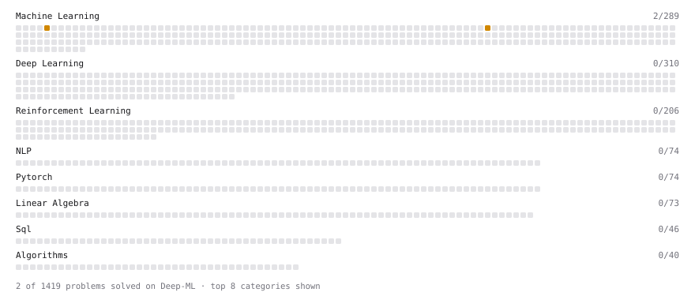

# Deep-ML

My machine learning practice from [Deep-ML](https://www.deep-ml.com). Every solution here was written by hand.

**2** solved · 1 problems · 0 labs · 1 math

[**Browse the interactive portfolio**](https://pbakshihub.github.io/deep-ml/) to replay this filling in over time.

## Problems

| | Difficulty | Solved | |
| --- | --- | --- | --- |
| [Implement Stratified Train-Test Split](https://www.deep-ml.com/problems/275) | medium | 2026-09-21 | [solution](problems/0275-implement-stratified-train-test-split) |

## Math

| | Difficulty | Solved | |
| --- | --- | --- | --- |
| [Training Error, Test Error and the Bayes Rate](https://www.deep-ml.com/math-problems/104) | medium | 2026-09-21 | [solution](math/0104-training-error-test-error-and-the-bayes-rate) |

---

_This file is regenerated by Deep-ML on every push._
