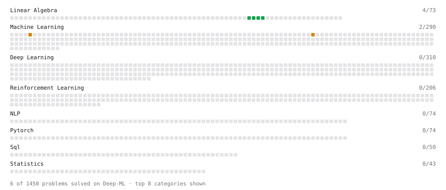

# Deep-ML

My machine learning practice from [Deep-ML](https://www.deep-ml.com). Every solution here was written by hand.

**13** solved · 8 problems · 1 labs · 4 math

[**Browse the interactive portfolio**](https://pbakshihub.github.io/deep-ml/) to replay this filling in over time.

## Problems

| | Difficulty | Solved | |
| --- | --- | --- | --- |
| [Tensor Puzzle: Extract the Diagonal](https://www.deep-ml.com/problems/1271) | easy | 2026-09-28 | [solution](problems/1271-tensor-puzzle-extract-the-diagonal) |
| [Tensor Puzzle: Identity Matrix from Comparisons](https://www.deep-ml.com/problems/1272) | easy | 2026-09-28 | [solution](problems/1272-tensor-puzzle-identity-matrix-from-comparisons) |
| [Tensor Puzzle: Ones Vector from First Principles](https://www.deep-ml.com/problems/1268) | easy | 2026-09-28 | [solution](problems/1268-tensor-puzzle-ones-vector-from-first-principles) |
| [Tensor Puzzle: Outer Product via Broadcasting](https://www.deep-ml.com/problems/1270) | easy | 2026-09-28 | [solution](problems/1270-tensor-puzzle-outer-product-via-broadcasting) |
| [Tensor Puzzle: Sum a Vector with a Dot Product](https://www.deep-ml.com/problems/1269) | easy | 2026-09-28 | [solution](problems/1269-tensor-puzzle-sum-a-vector-with-a-dot-product) |
| [Clean a Messy Dataset: Dedup, Standardize, Impute](https://www.deep-ml.com/problems/1131) | medium | 2026-09-29 | [solution](problems/1131-clean-a-messy-dataset-dedup-standardize-impute) |
| [Implement K-Fold Cross-Validation](https://www.deep-ml.com/problems/18) | medium | 2026-09-21 | [solution](problems/0018-implement-k-fold-cross-validation) |
| [Implement Stratified Train-Test Split](https://www.deep-ml.com/problems/275) | medium | 2026-09-21 | [solution](problems/0275-implement-stratified-train-test-split) |

## Labs

| | Difficulty | Solved | |
| --- | --- | --- | --- |
| [Data Preprocessing: Handling Missing Values](https://www.deep-ml.com/labs/11) | medium | 2026-09-30 | [solution](labs/0011-data-preprocessing-handling-missing-values) |

## Math

| | Difficulty | Solved | |
| --- | --- | --- | --- |
| [LOOCV vs $k$-Fold: the Bias-Variance of $k$](https://www.deep-ml.com/math-problems/80) | medium | 2026-09-21 | [solution](math/0080-loocv-vs-k-fold-the-bias-variance-of-k) |
| [Training Error, Test Error and the Bayes Rate](https://www.deep-ml.com/math-problems/104) | medium | 2026-09-21 | [solution](math/0104-training-error-test-error-and-the-bayes-rate) |
| [Interpolation and Double Descent](https://www.deep-ml.com/math-problems/118) | hard | 2026-09-21 | [solution](math/0118-interpolation-and-double-descent) |
| [Matrix Completion and Missing Values](https://www.deep-ml.com/math-problems/122) | hard | 2026-09-29 | [solution](math/0122-matrix-completion-and-missing-values) |

---

_This file is regenerated by Deep-ML on every push._
